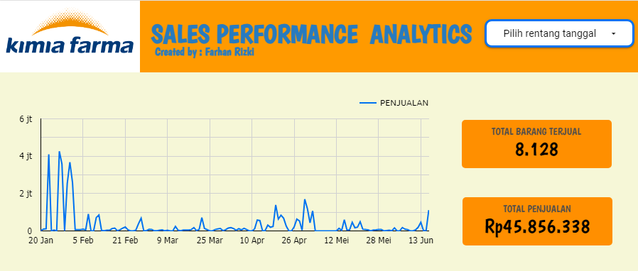
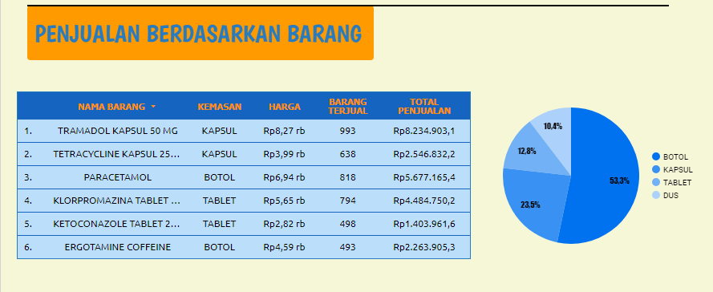
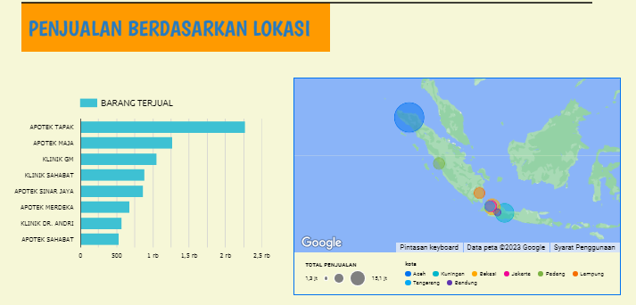

# Sales Analysis Dashboard using Looker Studio

This repository contains a Sales Analysis Dashboard created using Looker Studio. The dashboard provides an interactive platform to explore and analyze sales data, offering a range of visualizations and insights.

## Table of Contents
- [Introduction](#introduction)
- [SQL Querying](#sql-query-for-manage-data)
- [Accessing the Dashboard](#accessing-the-dashboard)
- [Dashboard Features](#dashboard-features)

## Introduction

Introduce your Sales Analysis Dashboard by explaining its significance and how it contributes to your business or organization's decision-making processes. Highlight its role in providing insights and driving sales strategies.

## SQL Query for Manage data

query for inputation data

[Link untuk query input data](https://github.com/frzkstudio/Sales_Analysis_Dashboard/blob/main/query_input_data.sql)

## Accessing the Dashboard

Provide information on how users can access the Looker Studio Sales Analysis Dashboard. Include any login credentials, permissions, or access instructions.

**Access Link:** [Sales Analysis Dashboard](https://lookerstudio.google.com/reporting/8b42f3cf-49fc-43fa-903c-c5e4964d16a7/page/KTvdD)

## Dashboard Features

header ini menjelaskan tentang

header ini menjelaskan tentang item pembelian

header ini menjelaskan tentang item pembelian

---
